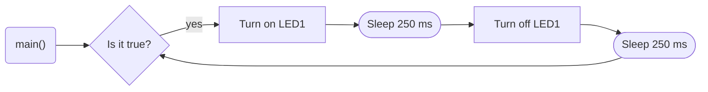

# Program 1: Heart beat
**Created by:** John M. Larkin (December 2020)

**Modified by:**

**Purpose:** This program flashes an internal LED on the LPC1768

## Hardware
### Internal
* LED1 (DigitalOut)

## Flow
